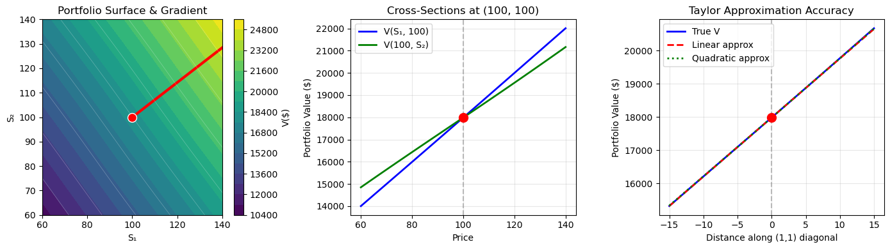

# Nonlinear Portfolio Risk Surface Analysis
## Multi-Order Sensitivity Mapping via Taylor Expansion & Spectral Decomposition

A rigorous quantitative finance framework designed to model, approximate, and visualize the risk surfaces of financial portfolios containing complex nonlinear interactions (e.g., structured products, exotic options, or multi-asset derivatives combinations). 

By leveraging **First-Order (Delta)** and **Second-Order (Gamma)** sensitivities, this repository demonstrates how to perform local risk approximations around a reference market state, identify directions of maximum exposure, and execute spectral decomposition on the portfolio's Hessian matrix to extract principal risk factors.

---

## 1. Theoretical Background

Real-world exotic portfolios rarely display linear sensitivity to underlying asset prices. When position values interact nonlinearly (due to cross-gamma effects, structural correlations, or correlation-dependent payoffs), a simple linear risk model fails. 

This framework defines a portfolio value function V(S1, S2) governed by linear position allocations combined with a high-frequency nonlinear interaction surface:

$$V(S_{1}, S_{2}) = w_{1} S_{1} + w_{2} S_{2} + k \sin\left(\frac{S_{1}}{20}\right)\cos\left(\frac{S_{2}}{20}\right)$$

Where:
* w1, w2 represent the nominal position sizes (linear exposures).
* k denotes the nonlinear interaction strength.
* The trigonometric arguments simulate periodic, non-monotonic mark-to-market fluctuations.

### Multi-Variable Taylor Expansion
To assess portfolio stability under localized market shocks, we construct a multi-variable Taylor series approximation around a specified reference state S* = (S1*, S2*):

#### First-Order Sensitivity (The Delta Gradient)
The Gradient vector maps the local linear directional sensitivities:

$$\nabla V(S_{1}, S_{2}) = \begin{bmatrix} \frac{\partial V}{\partial S_{1}} \\ \frac{\partial V}{\partial S_{2}} \end{bmatrix} = \begin{bmatrix} w_{1} + \frac{k}{20}\cos\left(\frac{S_{1}}{20}\right)\cos\left(\frac{S_{2}}{20}\right) \\ w_{2} - \frac{k}{20}\sin\left(\frac{S_{1}}{20}\right)\sin\left(\frac{S_{2}}{20}\right) \end{bmatrix}$$

The magnitude and normalized direction vector define the path of maximum portfolio appreciation (and conversely, maximum short exposure).

#### Second-Order Sensitivity (The Gamma Hessian)
The Hessian matrix captures the curvature (Gamma and Cross-Gamma risk) of the surface:

$$\mathcal{H}(S_{1}, S_{2}) = \begin{bmatrix} \frac{\partial^{2} V}{\partial S_{1}^{2}} & \frac{\partial^{2} V}{\partial S_{1} \partial S_{2}} \\ \frac{\partial^{2} V}{\partial S_{2} \partial S_{1}} & \frac{\partial^{2} V}{\partial S_{2}^{2}} \end{bmatrix}$$

Where the explicit analytical partial derivatives are:

$$\frac{\partial^{2} V}{\partial S_{1}^{2}} = -\frac{k}{400}\sin\left(\frac{S_{1}}{20}\right)\cos\left(\frac{S_{2}}{20}\right)$$

$$\frac{\partial^{2} V}{\partial S_{2}^{2}} = -\frac{k}{400}\sin\left(\frac{S_{1}}{20}\right)\cos\left(\frac{S_{2}}{20}\right)$$

$$\frac{\partial^{2} V}{\partial S_{1} \partial S_{2}} = -\frac{k}{400}\cos\left(\frac{S_{1}}{20}\right)\sin\left(\frac{S_{2}}{20}\right)$$

### Principal Risk Factors (Spectral Decomposition)
By executing an eigendecomposition on the symmetric Hessian matrix:

$$\mathcal{H} = Q \Lambda Q^{T}$$

We extract eigenvalues and their corresponding orthogonal eigenvectors. In a risk management context:
* **Eigenvalues:** quantify the magnitude of the portfolio's acceleration/deceleration under stress along specific market vectors. A negative eigenvalue implies a locally concave surface (short Gamma exposure), representing tail-risk under large shifts.
* **Eigenvectors:** define the precise synthetic combinations of underlying asset movements that represent the Principal Risk Axes.

---

## 2. Key Features

* **Analytical Exactness:** Computes exact symbolic First and Second-order derivatives rather than relying on unstable finite-difference approximations.
* **Multi-Order Comparison:** Evaluates the empirical breakdown of linear Delta-normal models versus Quadratic Gamma-adjusted models under stressed asset paths.
* **Spectral Analysis:** Isolates orthogonal risk channels via eigen-decomposition of the Hessian matrix.
* **Production-Ready Visualizations:** Generates comprehensive subplots mapping the risk surface contour, cross-sectional profiles, and diagonal Taylor convergence bounds.

---

## 3. Project Structure & Core Logic

The mathematical architecture is decoupled into pure operational functions for stability and testing:

```python
def portfolio_value(s1, s2):
    """Calculates mark-to-market portfolio value inclusive of nonlinear cross-effects."""
    return w1 * s1 + w2 * s2 + k * np.sin(s1 / 20) * np.cos(s2 / 20)

def compute_gradient(s1, s2):
    """Returns the analytical Delta gradient vector."""
    dV_dS1 = w1 + (k / 20) * np.cos(s1 / 20) * np.cos(s2 / 20)
    dV_dS2 = w2 - (k / 20) * np.sin(s1 / 20) * np.sin(s2 / 20)
    return np.array([dV_dS1, dV_dS2])

def compute_hessian(s1, s2):
    """Returns the symmetric analytical Gamma Hessian matrix."""
    h11 = -(k / 400) * np.sin(s1 / 20) * np.cos(s2 / 20)
    h22 = -(k / 400) * np.sin(s1 / 20) * np.cos(s2 / 20)
    h12 = -(k / 400) * np.cos(s1 / 20) * np.sin(s2 / 20)
    return np.array([[h11, h12], [h12, h22]])
```

---


## 4. Execution & Sample Outputs
```  <-- QUI CI VANNO PER RIAPRIRE (E INIZIARE IL TESTO DEL TERMINALE)
============================================================
PORTFOLIO RISK SURFACE ANALYSIS
============================================================
...
  Linear approx:   $18,636.35  (error: 3.08)
  Quadratic approx:$18,640.40  (error: 0.98)
============================================================
```  <-- QUI CI VANNO PER RICHIUDERE

### Risk Visualizations

